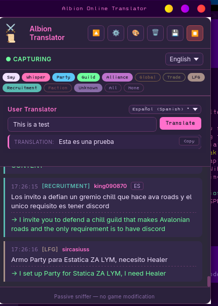

<p align="center">
  
</p>

# Albion Online Translator

[](https://www.apache.org/licenses/LICENSE-2.0)

A free and open-source cross-platform overlay application that translates Albion Online in-game chat in real-time. Built with Tauri v2, Svelte, and Rust.

## Features

- **Passive packet sniffing** — monitors UDP traffic on Albion's game ports
- **No game modification** — zero injection, zero memory reading, zero ban risk
- **Real-time translation** — detects language and translates to your preferred language via Google Translate
- **Always-on-top overlay** — transparent, click-through window that floats above the game
- **Cross-platform** — Linux, Windows, and macOS support
- **~80 languages** — searchable picker with native + English names
- **User translator** — type text and translate to any language (for outgoing chat)
- **Channel filtering** — toggle visibility per chat channel (Say, Whisper, Party, Guild, Alliance, Trade, LFG, Recruitment, Faction, Global)
- **Smart channel detection** — automatic via login roster, guided setup banner for mid-session captures
- **Channel persistence** — mappings saved to disk, survive app restarts within the same game session
- **Scroll freeze** — scroll up to pause auto-scroll, floating button to jump to latest
- **Language channel stripping** — English/Spanish/etc. language channels automatically dropped (no translation needed)
- **Whisper support** — private messages captured and translated

## Legal / Ban Safety

This application is **explicitly allowed** by Sandbox Interactive's stated policy:

> "As long as you just look and analyze we are ok with it. The moment you modify or manipulate something or somehow interfere with our services we will react."
> — MadDave, Technical Lead for Albion Online

This app:
- ✅ Only monitors network traffic (like Wireshark)
- ✅ Does NOT modify the game client
- ✅ Does NOT read game memory
- ✅ Does NOT inject into the game process
- ✅ Does NOT send input to the game

## Architecture

```
┌─────────────────┐     UDP 5055/5056/4535  ┌──────────────────┐
│  Albion Online  │ ◄──────────────────────► │  Game Server     │
│  (Game Client)  │                          │  (SBI)           │
└────────┬────────┘                          └──────────────────┘
         │
         │ (passive sniff)
         ▼
┌─────────────────┐
│  Packet Sniffer │  libpcap / Npcap
│  (Rust)         │  BPF filter: UDP ports 5055/5056/4535
└────────┬────────┘
         │
         ▼
┌─────────────────┐
│  Photon Decoder │  Protocol18 deserialization
│  (Rust)         │  ChatMessage (73), ChatSay (74), ChatWhisper (75)
│                 │  Channel roster (206), joins (207), leaves (208)
└────────┬────────┘
         │
         ▼
┌─────────────────┐
│  Translation    │  Google Translate API (auto-detect source)
│  Engine (Rust)  │  Language detection via lingua-rs
└────────┬────────┘
         │
         ▼
┌─────────────────┐
│  Svelte Overlay │  Tauri v2 webview
│  (Frontend)     │  Always-on-top, transparent, click-through
└─────────────────┘
```

## Channel Detection

Chat channels in Albion use dynamic runtime IDs assigned at login. The app resolves them via:

1. **Login roster (event 206)** — fires at login, maps all channels automatically
2. **Join events (event 207)** — fires when joining a channel mid-session
3. **Static table** — well-known IDs (Trade=17, Recruitment=18, LFG=19, Global=21)
4. **Setup banner** — for mid-session captures, a guided banner lets you tag unknown channels with one click
5. **Persistence** — channel mappings saved to `~/.config/albion-translator/channels.json`, loaded on startup

Language-specific channels (English, Español, etc.) are detected by name and dropped — they don't need translation.

## Building from Source

### Prerequisites

- **Rust** (2021 edition)
- **Node.js** 18+
- **libpcap** (Linux: `sudo apt install libpcap-dev`, macOS: `brew install libpcap`)
- **Npcap** (Windows: install with "WinPcap API-compatible Mode")

### Setup

```bash
# Clone
git clone https://github.com/synthalorian/AlbionOnline-Translator.git
cd AlbionOnline-Translator

# Install frontend deps
npm install

# Run in development
npm run tauri dev

# Build for production
npm run tauri build
```

### Linux Permissions

On Linux, grant capture capabilities to avoid running as root:

```bash
sudo setcap cap_net_raw,cap_net_admin=eip ./src-tauri/target/release/albion-translator
```

## Roadmap

- [x] Project scaffold (Tauri + Svelte + Rust)
- [x] Packet sniffer with pcap
- [x] Photon protocol decoder (Protocol18)
- [x] Chat event decoding (ChatMessage, ChatSay, ChatWhisper)
- [x] Channel roster decoding (206/207/208)
- [x] Channel resolution + persistence
- [x] Google Translate API integration
- [x] Language detection with lingua-rs
- [x] Always-on-top overlay GUI
- [x] Channel filtering + setup banner
- [x] Scroll freeze
- [x] User translator (outgoing chat)
- [x] Searchable language picker (~80 languages)
- [x] Language channel stripping
- [x] SQLite translation cache
- [x] CTranslate2 local translation models
- [x] Installer packaging (deb, rpm)
- [x] Auto-update mechanism
- [x] GitHub release with latest.json for updater
- [x] Click-through overlay mode
- [x] Compact/mini mode
- [x] Chat log export
- [x] Custom translation glossary (game terms)
- [ ] Windows/macOS CI builds (cross-compilation)

## References

- [Albion Online Data Project](https://www.albion-online-data.com/) — market data sniffer (proof of concept)
- [albion-online-stats](https://github.com/mazurwiktor/albion-online-stats) — DPS tracker (compliance reference)
- [albion-translator](https://github.com/beemerwt/albion-translator) — CLI translator (protocol reference)
- [albion-online-addons](https://github.com/mazurwiktor/albion-online-addons) — packet decoding library

## License

Apache-2.0 — free and open source, forever.

## Disclaimer

Not affiliated with Sandbox Interactive. Use at your own risk. While this app follows SBI's stated policy on passive monitoring, policies may change.

---

## ☕ Support the Developer

If this project saved you time, solved a problem, or just made your day a little more neon, you can fuel the next one:

[](https://buymeacoffee.com/synthalorian)
